# OpenSIPS 代理 GB28181 调研报告

## 1. 项目背景

GB28181（GBT 28281）是中国制定的《安全防范视频监控联网系统信息传输、交换、控制技术要求》国家标准，广泛应用于视频监控联网系统中。本报告调研基于 OpenSIPS 实现的 GB28181 SIP 信令代理方案。

### 1.1 GB28181 协议概述

GB28181 协议定义了视频监控系统中**前端设备（摄像头/NVR）**与**监控平台**之间的信令交互规范，基于 SIP 协议扩展实现。

### 1.2 系统角色

| 角色 | 说明 |
|------|------|
| **前端设备** | IP Camera、NVR 等设备，负责视频采集 |
| **监控平台** | EasyGBS、海康 ISUP 等平台，负责视频管理和分发 |
| **SIP 代理** | OpenSIPS，作为信令中转，支持设备与平台分离部署 |

---

## 2. 系统架构

### 2.1 整体架构

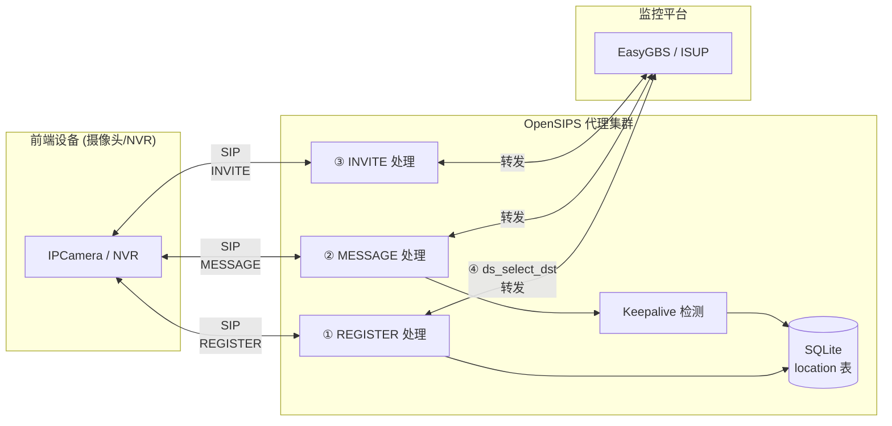
```mermaid
flowchart LR
    subgraph Devices["前端设备 (摄像头/NVR)"]
        IPC["IPCamera / NVR"]
    end

    subgraph OpenSIPS["OpenSIPS 代理集群"]
        direction TB
        REGISTER["① REGISTER 处理"]
        MESSAGE["② MESSAGE 处理"]
        INVITE["③ INVITE 处理"]
        KEEPALIVE["Keepalive 检测"]
        DATABASE[("SQLite<br/>location 表")]
        
        REGISTER --> DATABASE
        MESSAGE --> KEEPALIVE
        KEEPALIVE --> DATABASE
    end

    subgraph Platform["监控平台"]
        EasyGBS["EasyGBS / ISUP"]
    end

    IPC <-->|"SIP<br/>REGISTER"| REGISTER
    IPC <-->|"SIP<br/>MESSAGE"| MESSAGE
    IPC <-->|"SIP<br/>INVITE"| INVITE

    REGISTER <-->|"④ ds_select_dst<br/>转发"| EasyGBS
    MESSAGE <-->|"转发"| EasyGBS
    INVITE <-->|"转发"| EasyGBS
```

### 2.2 核心组件

| 模块 | 用途 |
|------|------|
| `usrloc` | 用户位置服务，存储设备注册信息（sql-only 模式） |
| `dispatcher` | **分发器模块，向上游平台转发请求，支持主备/负载均衡** |
| `tm` | 事务管理，处理 SIP 事务 |
| `nathelper` | NAT 穿透处理 |
| `xml` | 解析 GB28181 MANSCDP+xml 协议 |

---

## 3. 核心功能详解

### 3.1 设备注册 (REGISTER)

**路由**: `route[register]`

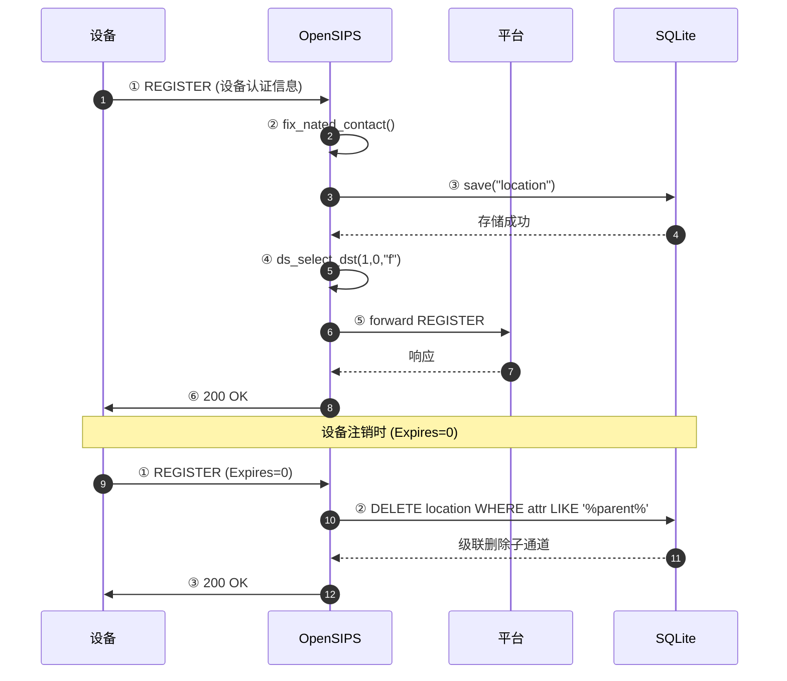
```mermaid
sequenceDiagram
    autonumber
    participant D as 设备
    participant O as OpenSIPS
    participant P as 平台
    participant DB as SQLite

    D->>O: ① REGISTER (设备认证信息)
    O->>O: ② fix_nated_contact()
    O->>DB: ③ save("location")
    DB-->>O: 存储成功
    O->>O: ④ ds_select_dst(1,0,"f")
    O->>P: ⑤ forward REGISTER
    P-->>O: 响应
    O->>D: ⑥ 200 OK

    Note over D,DB: 设备注销时 (Expires=0)
    D->>O: ① REGISTER (Expires=0)
    O->>DB: ② DELETE location WHERE attr LIKE '%parent%'
    DB-->>O: 级联删除子通道
    O->>D: ③ 200 OK
```

**关键逻辑**:
1. 接收设备 REGISTER 请求
2. `fix_nated_contact()` - 修正 NAT 场景下的 Contact 头
3. `save("location")` - 将设备信息存入 SQLite(location 表)
4. **使用 `ds_select_dst()` 向上游平台转发注册请求**
5. 设备注销时（Expires=0），级联删除该设备的所有子通道

```bash
route[register] {
    $avp(expires_hdr) = $hdr(Expires);
    fix_nated_contact();

    if (!save("location", "no-reply"))
        xlog("L_ERR", "REGISTER: failed for $tu\n");

    # 设备注销时：级联删除该设备的所有子通道
    if ($avp(expires_hdr) == "0") {
        sql_query("DELETE FROM location WHERE attr LIKE '%' || '$tu' || '%'");
        xlog("L_INFO", "REGISTER: child channels cleaned for $tu\n");
    }

    t_on_reply("handle_nat");
    if (ds_select_dst(1, 0, "f"))   # ← 使用 dispatcher 选择上游平台
        t_relay();
    else
        sl_send_reply(503, "Service Unavailable");
    return 1;
}
```

### 3.2 Dispatcher 模块：上游平台选择

Dispatcher 是 OpenSIPS 实现**上游平台主备切换**的核心模块。

#### 3.2.1 Dispatcher 数据表

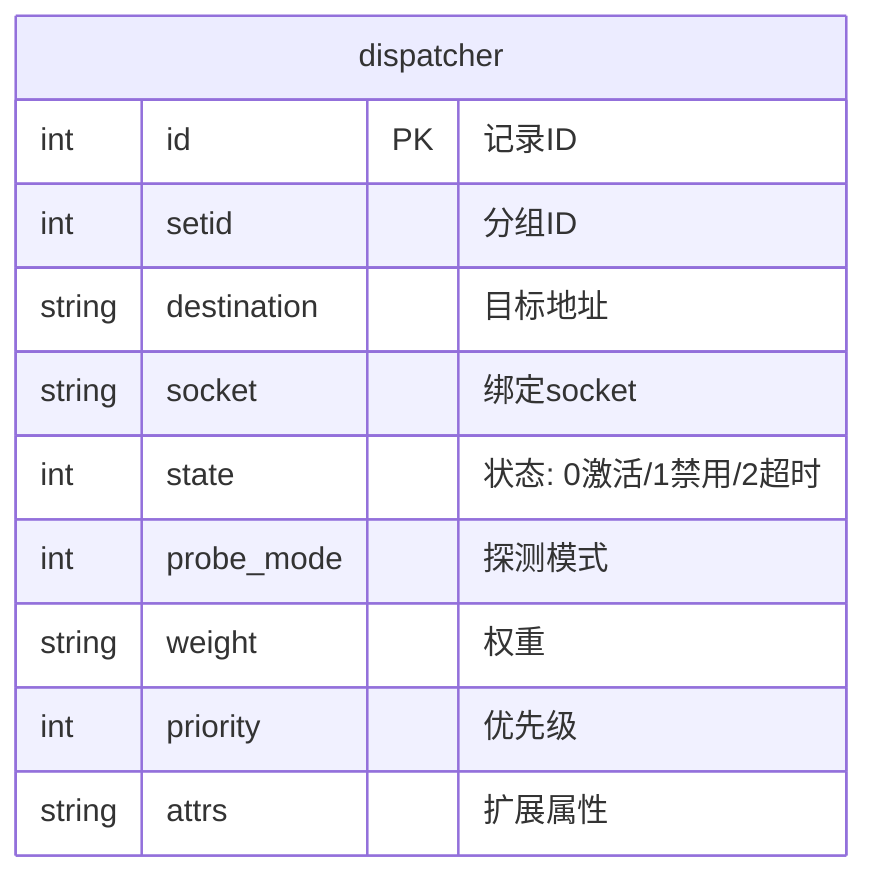
```mermaid
erDiagram
    dispatcher {
        int id PK "记录ID"
        int setid "分组ID"
        string destination "目标地址"
        string socket "绑定socket"
        int state "状态: 0激活/1禁用/2超时"
        int probe_mode "探测模式"
        string weight "权重"
        int priority "优先级"
        string attrs "扩展属性"
    }
```

**dispatcher 表配置示例** (`/etc/opensips/dbtext/dispatcher/dispatcher`):

```
id | setid | destination            | socket | state | probe_mode | weight | priority
---|-------|------------------------|--------|-------|------------|--------|---------
1  | 1     | sip:127.0.0.1:15060  | NULL   | 0     | 0          | 1      | 10      ← 主平台
2  | 1     | sip:192.168.1.100:5060| NULL   | 0     | 0          | 1      | 5       ← 备平台
```

#### 3.2.2 Dispatcher 选择逻辑

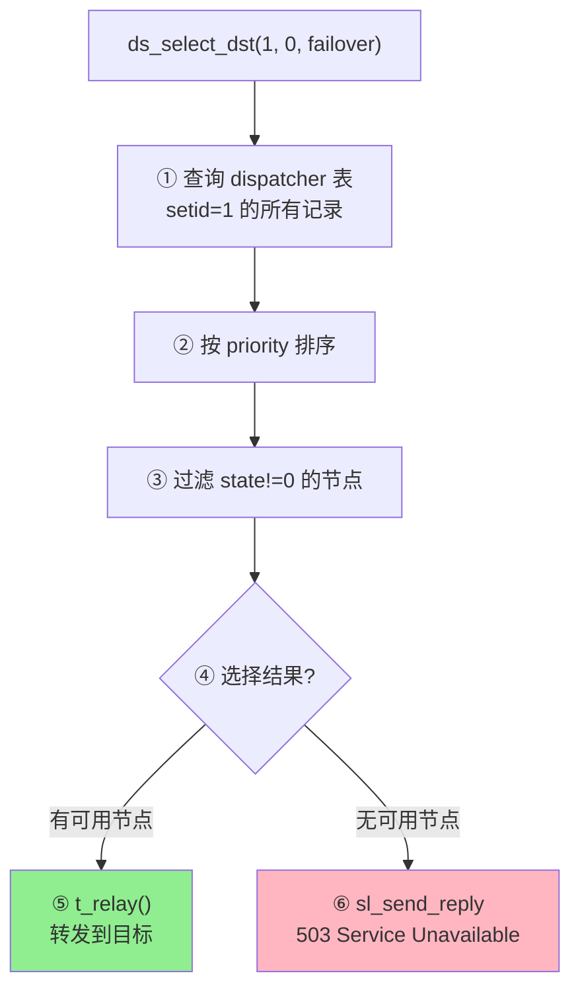
```mermaid
flowchart TD
    START["ds_select_dst(1, 0, failover)"] --> QUERY["① 查询 dispatcher 表<br/>setid=1 的所有记录"]

    QUERY --> SORT["② 按 priority 排序"]
    SORT --> FILTER["③ 过滤 state!=0 的节点"]

    FILTER --> CHECK{"④ 选择结果?"}

    CHECK -->|"有可用节点"| RELAY["⑤ t_relay()<br/>转发到目标"]
    CHECK -->|"无可用节点"| FAIL["⑥ sl_send_reply<br/>503 Service Unavailable"]

    style RELAY fill:#90EE90
    style FAIL fill:#FFB6C1
```

**参数说明**:

| 参数 | 值 | 说明 |
|------|-----|------|
| `1` | setid | 分组 ID，匹配 dispatcher 表中的 setid 字段 |
| `0` | flags | 标志位，0 表示普通模式 |
| `"f"` | mode | **"f" = failover 模式**，按优先级顺序尝试，故障自动切换 |

#### 3.2.3 代理到平台的主备切换

> **说明**：本节描述 OpenSIPS 代理向上游平台转发请求时的主备切换机制，与 3.3 节的"代理层主备切换"（VIP + Keepalived）是两个不同的层级。

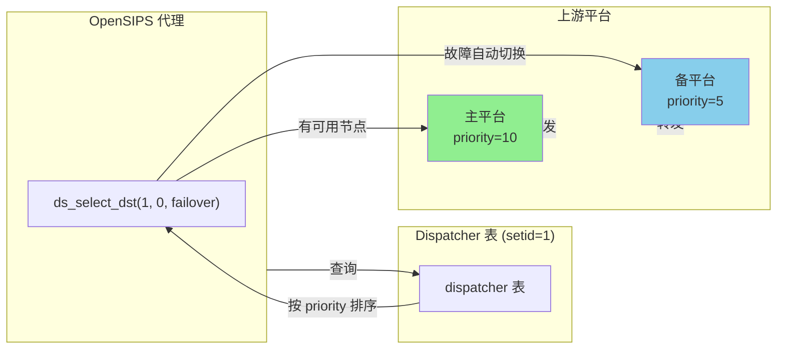
```mermaid
flowchart LR
    subgraph Proxy["OpenSIPS 代理"]
        DS["ds_select_dst(1, 0, failover)"]
    end

    subgraph Dispatcher["Dispatcher 表 (setid=1)"]
        TABLE["dispatcher 表"]
    end

    subgraph Platform["上游平台"]
        PRIMARY["主平台<br/>priority=10"]
        BACKUP["备平台<br/>priority=5"]
    end

    Proxy -->|"查询"| TABLE
    TABLE -->|"按 priority 排序"| DS
    DS -->|"有可用节点"| PRIMARY
    DS -->|"故障自动切换"| BACKUP

    PRIMARY -->|"转发"| Platform
    BACKUP -->|"转发"| Platform

    style PRIMARY fill:#90EE90
    style BACKUP fill:#87CEEB
```

**工作原理**:

1. OpenSIPS 调用 `ds_select_dst(1, 0, "f")` 查询 dispatcher 表
2. 按 `priority` 降序排列所有可用节点（state=0）
3. 优先选择主平台（priority=10）转发请求
4. 若主平台故障，自动切换到备平台（priority=5）
5. 所有节点不可用时返回 503

**ds_select_dst 调用位置**:

| 路由 | 用途 |
|------|------|
| `route[register]` | 转发设备注册请求到平台 |
| `route[device_response]` | 转发设备响应到平台 |
| `route[forward]` | 通用转发 |

### 3.3 主备切换机制：VIP + Keepalived

**代理层通过 VIP + Keepalived 实现高可用，设备只需连接 VIP 地址即可。**

#### 3.3.1 VIP 漂移时序

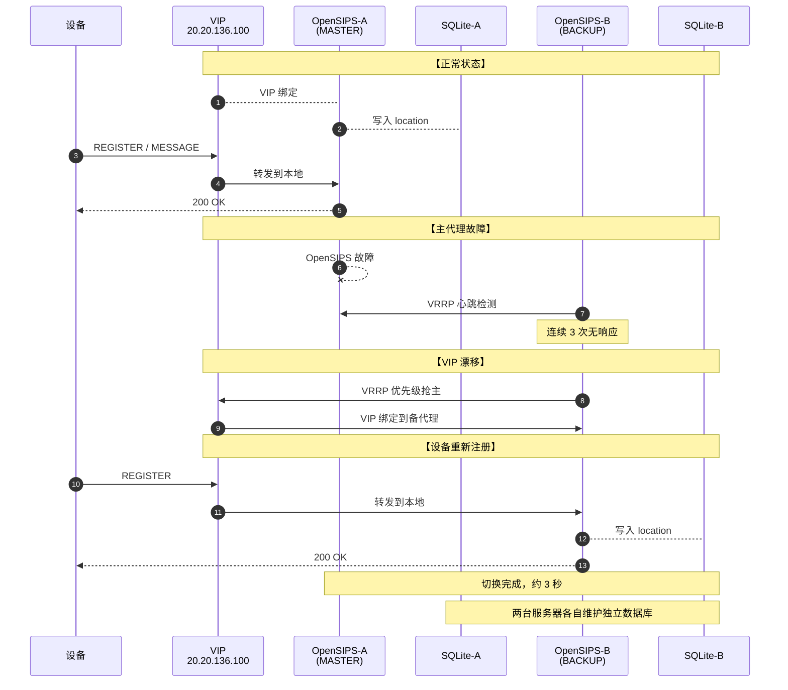
```mermaid
sequenceDiagram
    autonumber
    participant D as 设备
    participant VIP as VIP<br/>20.20.136.100
    participant MA as OpenSIPS-A<br/>(MASTER)
    participant DBA as SQLite-A
    participant MB as OpenSIPS-B<br/>(BACKUP)
    participant DBB as SQLite-B

    Note over VIP,DBB: 【正常状态】
    VIP --> MA: VIP 绑定
    MA --> DBA: 写入 location
    D->>VIP: REGISTER / MESSAGE
    VIP->>MA: 转发到本地
    MA-->>D: 200 OK

    Note over VIP,DBB: 【主代理故障】
    MA --x MA: OpenSIPS 故障
    MB ->> MA: VRRP 心跳检测
    Note over MB: 连续 3 次无响应

    Note over VIP,DBB: 【VIP 漂移】
    MB ->> VIP: VRRP 优先级抢主
    VIP ->> MB: VIP 绑定到备代理

    Note over VIP,DBB: 【设备重新注册】
    D->>VIP: REGISTER
    VIP->>MB: 转发到本地
    MB --> DBB: 写入 location
    MB-->>D: 200 OK
    Note over MA,DBB: 切换完成，约 3 秒
    Note over DBA,DBB: 两台服务器各自维护独立数据库
```

#### 3.3.2 Keepalive 心跳检测

**Keepalive 检测用于验证设备注册状态，辅助判断设备是否需要重新注册。**

**路由**: `route[check_keepalive]`

**触发条件**: MESSAGE 请求且 Content-Type 为 `Application/MANSCDP+xml`，消息体包含 `Keepalive`

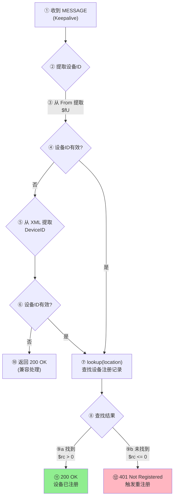
```mermaid
flowchart TD
    START["① 收到 MESSAGE<br/>(Keepalive)"] --> ID1{"② 提取设备ID"}
    ID1 -->|"③ 从 From 提取<br/>$fU"| CHECK1{"④ 设备ID有效?"}
    CHECK1 -->|"否"| ID2{"⑤ 从 XML 提取<br/>DeviceID"}
    ID2 --> CHECK2{"⑥ 设备ID有效?"}
    CHECK2 -->|"否"| RET1["⑩ 返回 200 OK<br/>(兼容处理)"]
    CHECK1 -->|"是"| LOOKUP
    CHECK2 -->|"是"| LOOKUP

    LOOKUP["⑦ lookup(location)<br/>查找设备注册记录"] --> RESULT{"⑧ 查找结果"}

    RESULT -->|"⑨a 找到<br/>$rc > 0"| RET2["⑪ 200 OK<br/>设备已注册"]
    RESULT -->|"⑨b 未找到<br/>$rc <= 0"| RET3["⑫ 401 Not Registered<br/>触发重注册"]

    style RET2 fill:#90EE90
    style RET3 fill:#FFB6C1
```

```bash
route[check_keepalive] {
    # 从 From header 提取设备ID（Keepalive 发起方）
    $var(device_id) = $fU;

    if ($var(device_id) == "" || $var(device_id) == NULL) {
        # fallback: 从 XML DeviceID 提取
        $var(device_id) = $xml($rb/Notify/DeviceID.val);
    }

    if ($var(device_id) == "" || $var(device_id) == NULL) {
        xlog("L_WARN", "KEEPALIVE: cannot extract device ID\n");
        sl_send_reply(200, "OK");
        return;
    }

    xlog("L_INFO", "KEEPALIVE: device=$var(device_id)\n");

    # 检查设备是否已注册
    $ru = "sip:" + $var(device_id) + "@" + $td;
    lookup("location");

    if ($rc > 0) {
        sl_send_reply(200, "OK");      # 设备已注册
    } else {
        xlog("L_INFO", "KEEPALIVE: device NOT registered, reply 401\n");
        sl_send_reply(401, "Not Registered");  # 未注册，触发设备重注册
    }
}
```

#### 3.3.3 切换流程

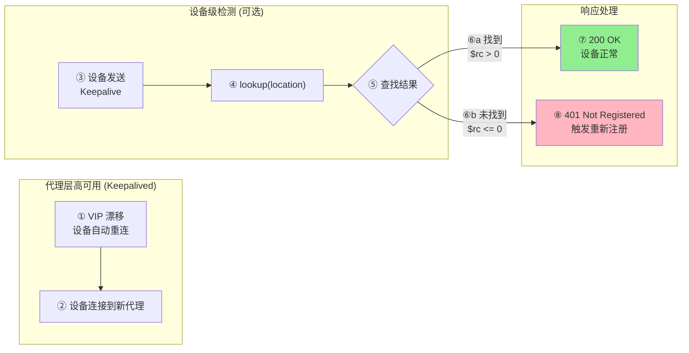
```mermaid
flowchart LR
    subgraph HA_Failover["代理层高可用 (Keepalived)"]
        V["① VIP 漂移<br/>设备自动重连"] --> NEW["② 设备连接到新代理"]
    end

    subgraph Detection["设备级检测 (可选)"]
        K["③ 设备发送<br/>Keepalive"] --> L["④ lookup(location)"]
        L --> R{"⑤ 查找结果"}
    end

    subgraph Response["响应处理"]
        R -->|"⑥a 找到<br/>$rc > 0"| OK["⑦ 200 OK<br/>设备正常"]
        R -->|"⑥b 未找到<br/>$rc <= 0"| ERR["⑧ 401 Not Registered<br/>触发重新注册"]
    end

    style OK fill:#90EE90
    style ERR fill:#FFB6C1
```

#### 3.3.4 Keepalived 配置示例

```bash
# /etc/keepalived/keepalived.conf (主代理)
global_defs {
    router_id opensips_master
}

vrrp_instance VI_1 {
    state MASTER
    interface eth0
    virtual_router_id 51
    priority 100        # 主代理优先级高
    advert_int 1
    authentication {
        auth_type PASS
        auth_pass 1234
    }
    virtual_ipaddress {
        20.20.136.100 dev eth0  # VIP 地址
    }
    track_script {
        chk_opensips
    }
}

vrrp_script chk_opensips {
    script "/etc/keepalived/chk_opensips.sh"
    interval 2
    weight -20
}
```

**关键配置说明**:

| 配置项 | 说明 |
|--------|------|
| `virtual_ipaddress` | VIP 地址，设备连接此地址 |
| `priority` | 主代理 100，备代理 90 |
| `track_script` | 检测 OpenSIPS 进程状态 |
| `weight -20` | 检测失败时自动降低优先级触发切换 |

#### 3.3.5 数据库配置

两台服务器各自维护独立的 SQLite 数据库，用于存储设备注册信息。

```bash
# 服务器 A 和 B 的 OpenSIPS 配置
modparam("usrloc", "db_url", "sqlite:///var/lib/opensips/opensips.db")
```

**数据库文件位置**:

| 服务器 | SQLite 路径 |
|--------|-------------|
| 服务器 A | `/var/lib/opensips/opensips.db` |
| 服务器 B | `/var/lib/opensips/opensips.db` |

**location 表结构**:

```sql
CREATE TABLE location (
    username    CHAR(64),     -- 设备ID
    contact     TEXT,         -- 实际联系地址
    expires     INTEGER,      -- 过期时间戳
    q           FLOAT,        -- Q值（子通道=-1.0）
    attr        CHAR(255),   -- 扩展属性（存父设备信息）
    ...
);
```

**重要说明**: VIP 漂移后，备代理需要重新接收设备注册，SQLite-A 和 SQLite-B 数据独立。

### 3.4 MESSAGE 消息处理

**路由**: `route[message]`

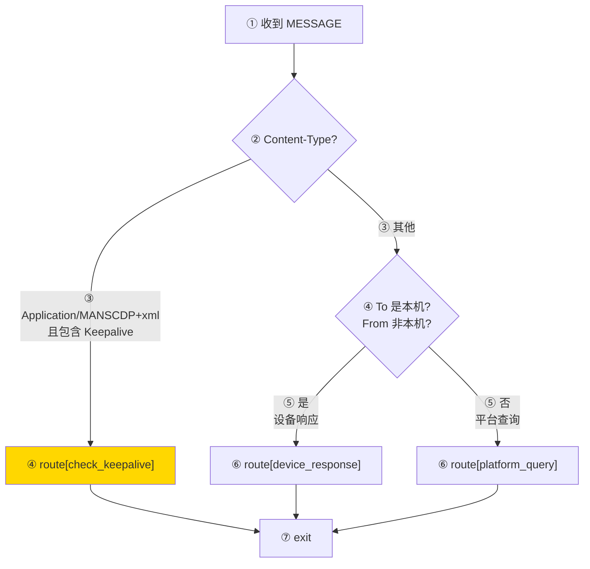
```mermaid
flowchart TD
    START["① 收到 MESSAGE"] --> CT{"② Content-Type?"}
    CT -->|"③ Application/MANSCDP+xml<br/>且包含 Keepalive"| KEEPALIVE["④ route[check_keepalive]"]
    CT -->|"③ 其他"| CHECK{"④ To 是本机?<br/>From 非本机?"}

    CHECK -->|"⑤ 是<br/>设备响应"| RESP["⑥ route[device_response]"]
    CHECK -->|"⑤ 否<br/>平台查询"| QUERY["⑥ route[platform_query]"]

    KEEPALIVE --> END["⑦ exit"]
    RESP --> END
    QUERY --> END

    style KEEPALIVE fill:#FFD700
```

```bash
route[message] {
    # === Keepalive 心跳检查 ===
    if ($hdr(Content-Type) == "Application/MANSCDP+xml" && $rb =~ "Keepalive") {
        route(check_keepalive);
        exit;
    }

    # === 正常 MESSAGE 处理 ===
    if (is_myself("$td") && !is_myself("$fd")) {
        route(device_response);
    } else {
        route(platform_query);
    }
    return 1;
}
```

### 3.5 设备响应处理

**路由**: `route[device_response]`

设备响应平台查询时的处理：

| 消息类型 | 处理路由 | 说明 |
|----------|----------|------|
| Catalog | `route[process_catalog]` | 解析子通道信息 |
| DeviceInfo | `route[process_device_info]` | 设备信息处理 |

```bash
route[device_response] {
    # 按命令类型分发
    if ($rb =~ "Catalog") {
        route(process_catalog);
    } else if ($rb =~ "DeviceInfo") {
        route(process_device_info);
    }
    # 转发设备响应到平台
    append_hf("P-hint: outbound\r\n");
    t_on_reply("handle_nat");
    if (ds_select_dst(1, 0, "f"))   # ← 转发到上游平台
        t_relay();
    else
        sl_send_reply(503, "Service Unavailable");
    return 1;
}
```

### 3.6 Catalog 子通道解析

**路由**: `route[process_catalog]`

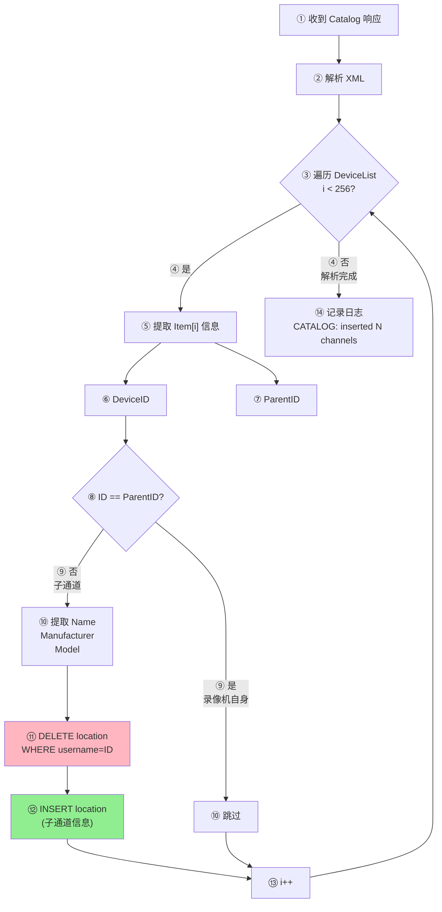
```mermaid
flowchart TD
    START["① 收到 Catalog 响应"] --> PARSE["② 解析 XML"]
    PARSE --> LOOP{"③ 遍历 DeviceList<br/>i < 256?"}

    LOOP -->|"④ 是"| GET["⑤ 提取 Item[i] 信息"]
    GET --> ID["⑥ DeviceID"]
    GET --> PID["⑦ ParentID"]

    ID --> SELF{"⑧ ID == ParentID?"}
    SELF -->|"⑨ 是<br/>录像机自身"| SKIP["⑩ 跳过"]
    SELF -->|"⑨ 否<br/>子通道"| DETAIL["⑩ 提取 Name<br/>Manufacturer<br/>Model"]

    DETAIL --> DEL["⑪ DELETE location<br/>WHERE username=ID"]
    DEL --> INS["⑫ INSERT location<br/>(子通道信息)"]
    INS --> INC["⑬ i++"]
    INC --> LOOP

    LOOP -->|"④ 否<br/>解析完成"| LOG["⑭ 记录日志<br/>CATALOG: inserted N channels"]

    SKIP --> INC

    style DEL fill:#FFB6C1
    style INS fill:#90EE90
```

**解析逻辑**:
```xml
<!-- Catalog 响应示例 -->
<Response>
    <DeviceList>
        <Item>
            <DeviceID>通道ID</DeviceID>
            <ParentID>父设备ID</ParentID>
            <Name>通道名称</Name>
            <Manufacturer>厂商</Manufacturer>
            <Model>型号</Model>
        </Item>
    </DeviceList>
</Response>
```

**存储策略**:
- 跳过录像机自身（通道ID == 父ID）
- 使用 `DELETE + INSERT` 实现去重（同一 deviceId 只保留一条）
- `q=-1.0` 标记为子通道（非主注册设备）

```bash
route[process_catalog] {
    $xml(cat) = $rb;
    $var(cnt) = 0;
    $var(i) = 0;

    while ($var(i) < 256) {
        $avp(chan_id) = $xml(cat/Response/DeviceList/Item[$var(i)]/DeviceID.val);
        if ($avp(chan_id) == NULL || $(avp(chan_id){s.len}) == 0)
            break;

        $avp(parent_id) = $xml(cat/Response/DeviceList/Item[$var(i)]/ParentID.val);

        # 跳过录像机自身（通道ID == 父ID）
        if ($avp(chan_id) != $avp(parent_id)) {
            $avp(chan_name) = $xml(cat/Response/DeviceList/Item[$var(i)]/Name.val);
            $avp(chan_manufacturer) = $xml(cat/Response/DeviceList/Item[$var(i)]/Manufacturer.val);
            $avp(chan_model) = $xml(cat/Response/DeviceList/Item[$var(i)]/Model.val);
            $avp(recorder_contact) = "sip:" + $avp(chan_id) + "@" + $si + ":" + $sp;
            $avp(channel_ua) = $avp(chan_manufacturer) + " " + $avp(chan_model) + " (" + $avp(chan_name) + ")";
            $avp(channel_attr) = "parent=" + $fu;
            # 使用 DELETE + INSERT 实现去重
            sql_query("DELETE FROM location WHERE username='$avp(chan_id)'");
            sql_query("INSERT INTO location (username, domain, contact, expires, q, callid, cseq, last_modified, flags, user_agent, socket, attr)
                VALUES ('$avp(chan_id)', '$fd', '$avp(recorder_contact)', 1790000000, -1.0, '$ci', 9999, datetime('now', 'localtime'), 0, '$avp(channel_ua)', 'udp:$socket_in(ip):$socket_in(port)', '$avp(channel_attr)')");
            $var(cnt) = $var(cnt) + 1;
        }
        $var(i) = $var(i) + 1;
    }
    xlog("L_INFO", "CATALOG: inserted $var(cnt) channels\n");
    $xml(cat) = NULL;
    return 1;
}
```

### 3.7 INVITE 呼叫处理

**路由**: `route[invite]`

#### 3.7.1 GB28181 回放流程

**路由**: `route[gb28181_playback]`

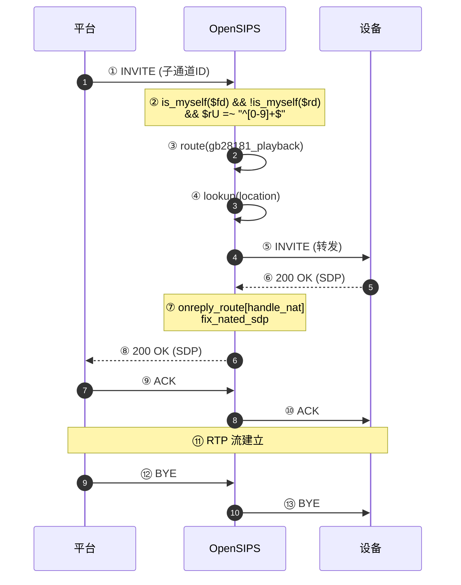
```mermaid
sequenceDiagram
    autonumber
    participant P as 平台
    participant O as OpenSIPS
    participant D as 设备

    P->>O: ① INVITE (子通道ID)
    Note over O: ② is_myself($fd) && !is_myself($rd)<br/>&& $rU =~ "^[0-9]+$"
    O->>O: ③ route(gb28181_playback)
    O->>O: ④ lookup(location)
    O->>D: ⑤ INVITE (转发)
    D-->>O: ⑥ 200 OK (SDP)
    Note over O: ⑦ onreply_route[handle_nat]<br/>fix_nated_sdp
    O-->>P: ⑧ 200 OK (SDP)
    P->>O: ⑨ ACK
    O->>D: ⑩ ACK
    Note over P,D: ⑪ RTP 流建立
    P->>O: ⑫ BYE
    O->>D: ⑬ BYE
```

**识别条件**:
- From/To 域名是本机: `is_myself("$fd") || is_myself("$td")`
- R-URI 域名非本机: `!is_myself("$rd")`
- 用户名是纯数字: `$rU =~ "^[0-9]+$"`

#### 3.7.2 SDP 修复

**onreply_route[handle_nat]**

GB28181 设备响应 200 OK 时缺少 SDP 属性，注入必要字段：

```
a=setup:active      -- 设备主动发起 TCP 连接
a=connection:new    -- 新建连接
```

```bash
onreply_route[handle_nat] {
    # === GB28181 SDP 修复 ===
    if (t_check_status("200") && $mb =~ "application/sdp") {
        fix_nated_sdp("add-no-rtpproxy", "$socket_in(ip)", "\r\na=setup:active\r\na=connection:new");
    }
    fix_nated_contact();
}
```

---

## 4. 数据库表结构

### 4.1 location 表（设备注册）

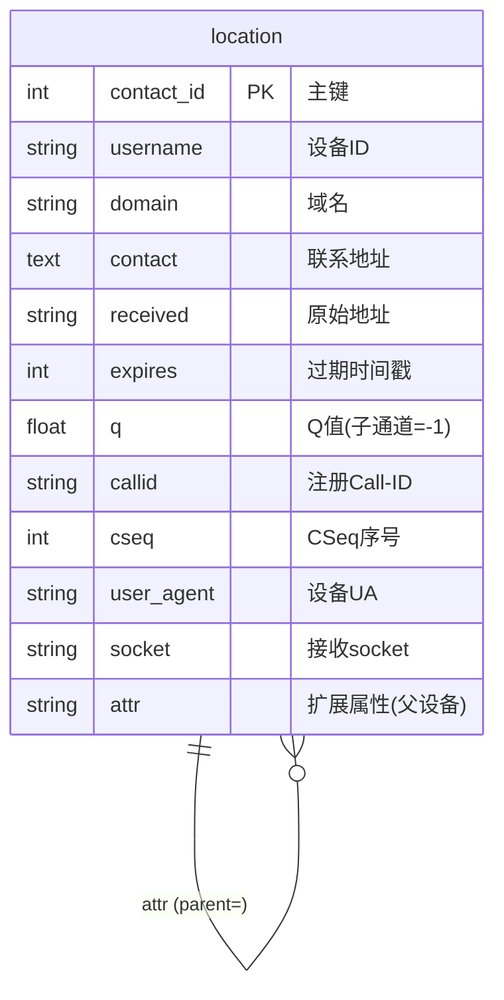
```mermaid
erDiagram
    location {
        int contact_id PK "主键"
        string username "设备ID"
        string domain "域名"
        text contact "联系地址"
        string received "原始地址"
        int expires "过期时间戳"
        float q "Q值(子通道=-1)"
        string callid "注册Call-ID"
        int cseq "CSeq序号"
        string user_agent "设备UA"
        string socket "接收socket"
        string attr "扩展属性(父设备)"
    }

    location ||--o{ location : "attr (parent=)"
```

### 4.2 dispatcher 表（上游平台）

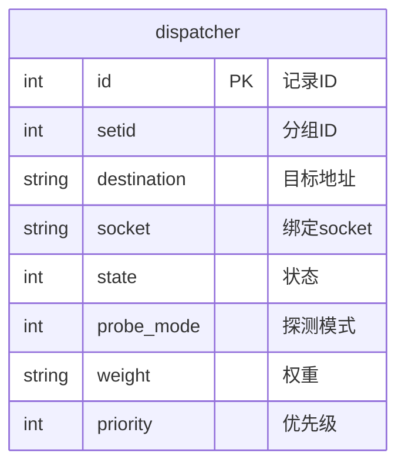
```mermaid
erDiagram
    dispatcher {
        int id PK "记录ID"
        int setid "分组ID"
        string destination "目标地址"
        string socket "绑定socket"
        int state "状态"
        int probe_mode "探测模式"
        string weight "权重"
        int priority "优先级"
    }
```

---

## 5. 典型信令流程

### 5.1 设备上线流程

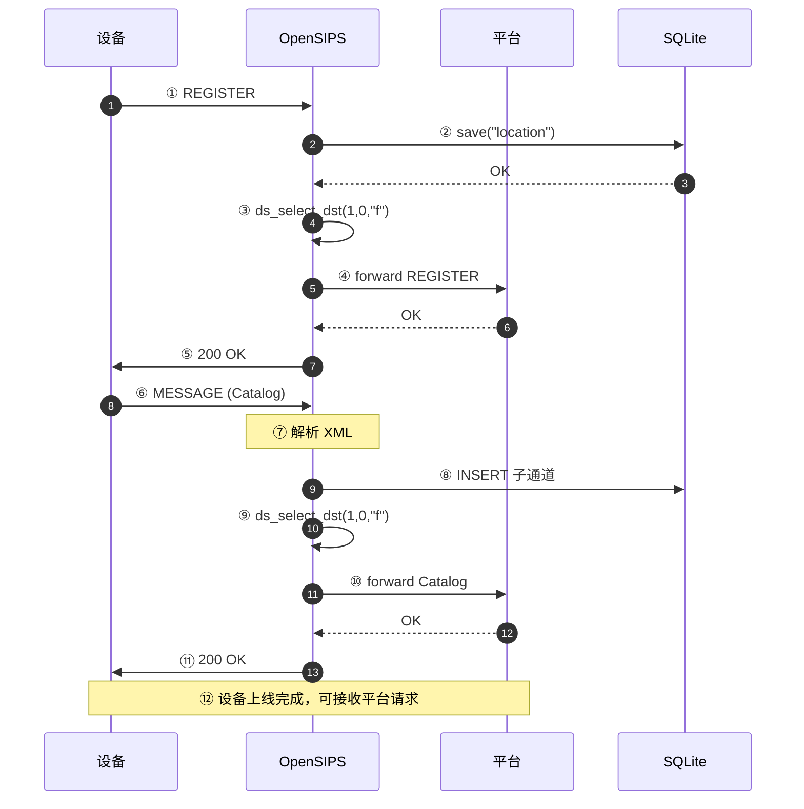
```mermaid
sequenceDiagram
    autonumber
    participant D as 设备
    participant O as OpenSIPS
    participant P as 平台
    participant DB as SQLite

    D->>O: ① REGISTER
    O->>DB: ② save("location")
    DB-->>O: OK
    O->>O: ③ ds_select_dst(1,0,"f")
    O->>P: ④ forward REGISTER
    P-->>O: OK
    O->>D: ⑤ 200 OK

    D->>O: ⑥ MESSAGE (Catalog)
    Note over O: ⑦ 解析 XML
    O->>DB: ⑧ INSERT 子通道
    O->>O: ⑨ ds_select_dst(1,0,"f")
    O->>P: ⑩ forward Catalog
    P-->>O: OK
    O->>D: ⑪ 200 OK

    Note over D,P: ⑫ 设备上线完成，可接收平台请求
```

### 5.2 Keepalive 保活与主备切换流程

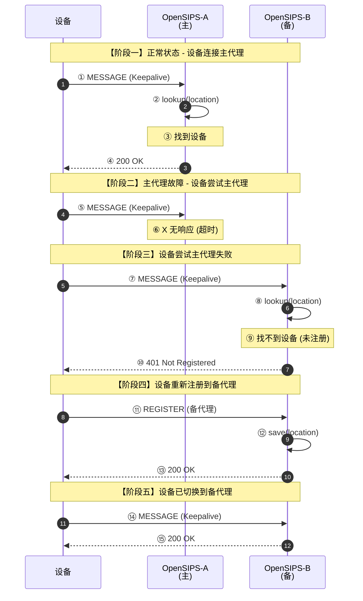
```mermaid
sequenceDiagram
    autonumber
    participant D as 设备
    participant MA as OpenSIPS-A<br/>(主)
    participant MB as OpenSIPS-B<br/>(备)

    Note over D,MB: 【阶段一】正常状态 - 设备连接主代理
    D->>MA: ① MESSAGE (Keepalive)
    MA->>MA: ② lookup(location)
    Note over MA: ③ 找到设备
    MA-->>D: ④ 200 OK

    Note over D,MB: 【阶段二】主代理故障 - 设备尝试主代理
    D->>MA: ⑤ MESSAGE (Keepalive)
    Note over MA: ⑥ X 无响应 (超时)

    Note over D,MB: 【阶段三】设备尝试主代理失败
    D->>MB: ⑦ MESSAGE (Keepalive)
    MB->>MB: ⑧ lookup(location)
    Note over MB: ⑨ 找不到设备 (未注册)
    MB-->>D: ⑩ 401 Not Registered

    Note over D,MB: 【阶段四】设备重新注册到备代理
    D->>MB: ⑪ REGISTER (备代理)
    MB->>MB: ⑫ save(location)
    MB-->>D: ⑬ 200 OK

    Note over D,MB: 【阶段五】设备已切换到备代理
    D->>MB: ⑭ MESSAGE (Keepalive)
    MB-->>D: ⑮ 200 OK
```

---

## 6. 主备配置建议

### 6.1 完整部署架构

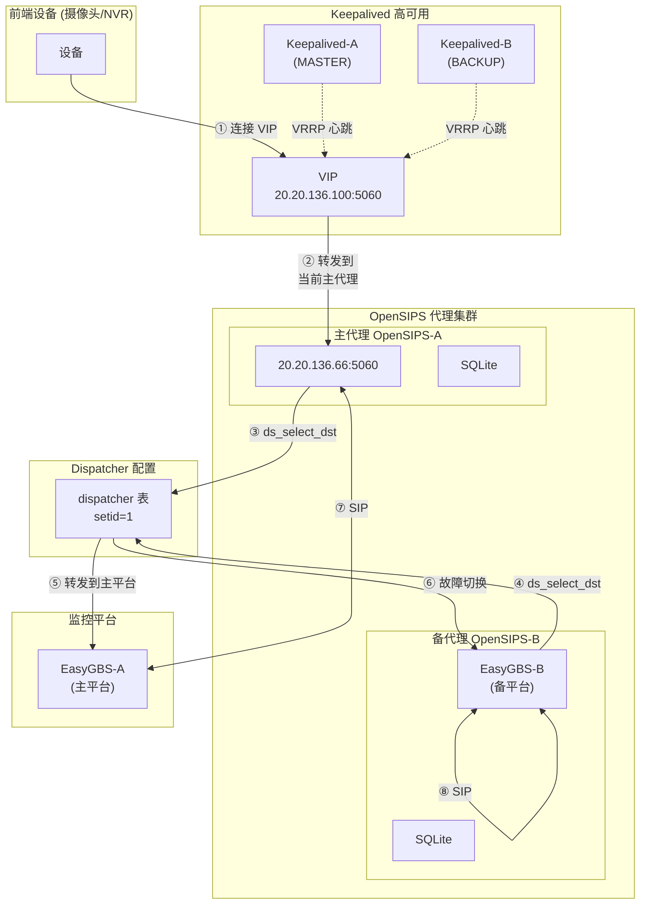
```mermaid
flowchart TB
    subgraph Devices["前端设备 (摄像头/NVR)"]
        D1["设备"]
    end

    subgraph HA["Keepalived 高可用"]
        VIP["VIP<br/>20.20.136.100:5060"]
        KA["Keepalived-A<br/>(MASTER)"]
        KB["Keepalived-B<br/>(BACKUP)"]
    end

    subgraph OpenSIPS["OpenSIPS 代理集群"]
        subgraph Primary["主代理 OpenSIPS-A"]
            PA["20.20.136.66:5060"]
            DBA["SQLite"]
        end

        subgraph Backup["备代理 OpenSIPS-B"]
            PB["20.20.136.67:5060"]
            DBB["SQLite"]
        end
    end

    subgraph Dispatcher["Dispatcher 配置"]
        DT["dispatcher 表<br/>setid=1"]
    end

    subgraph Platform["监控平台"]
        PP["EasyGBS-A<br/>(主平台)"]
        PB["EasyGBS-B<br/>(备平台)"]
    end

    D1 -->|"① 连接 VIP"| VIP
    VIP -->|"② 转发到<br/>当前主代理"| PA

    KA -.->|"VRRP 心跳"| VIP
    KB -.->|"VRRP 心跳"| VIP

    PA -->|"③ ds_select_dst"| DT
    PB -->|"④ ds_select_dst"| DT

    DT -->|"⑤ 转发到主平台"| PP
    DT -->|"⑥ 故障切换"| PB

    PP <-->|"⑦ SIP"| PA
    PB <-->|"⑧ SIP"| PB
```

### 6.2 Dispatcher 表配置示例

**上游平台主备配置**:

```bash
# /etc/opensips/dbtext/dispatcher/dispatcher
id | setid | destination              | state | probe_mode | weight | priority
---|-------|--------------------------|-------|------------|--------|---------
1  | 1     | sip:10.0.0.10:5060      | 0     | 0          | 1      | 10      ← 主平台
2  | 1     | sip:10.0.0.11:5060      | 0     | 0          | 1      | 5       ← 备平台
```

**配置说明**:

| 字段 | 说明 |
|------|------|
| `setid=1` | 分组 ID，调用 `ds_select_dst(1, ...)` 时使用 |
| `state=0` | 0=激活，1=禁用，2=超时，4=不可达 |
| `priority` | 优先级，数值越大优先级越高 |
| `probe_mode` | 0=不主动探测，1=主动探测 |

### 6.3 设备配置（GB28181 设备侧）

设备只需配置 VIP 地址，无需配置多个服务器：

| 配置项 | 说明 |
|--------|------|
| SIP 服务器 | VIP 地址 (如 20.20.136.100:5060) |

设备通过 VIP 连接代理，当主代理故障时：
1. **Keepalived 检测到主代理故障，VIP 漂移到备代理**（约 3 秒）
2. 设备自动重连到 VIP
3. **设备无感知，完成主备切换**

---

## 7. 配置参数速查

| 功能 | 关键函数 | 路由 | 说明 |
|------|----------|------|------|
| 设备注册 | `save("location")` | `route[register]` | 存储设备到 SQLite |
| 设备查询 | `lookup("location")` | `route[platform_query]` | 查找设备注册记录 |
| Keepalive 检测 | `lookup("location")` + 401 | `route[check_keepalive]` | 设备主备切换核心 |
| 上游平台选择 | `ds_select_dst(1,0,"f")` | 多处 | Dispatcher 主备切换 |
| 子通道解析 | XML 解析 + SQL INSERT | `route[process_catalog]` | 解析 Catalog 响应 |
| 发送请求 | `t_relay()` | 各路由 | 转发 SIP 消息 |
| NAT 修复 | `fix_nated_contact()` | `route[register]` | 修正 NAT 场景 |

---

## 8. 故障排查

### 8.1 查看注册设备

```bash
sqlite3 /var/lib/opensips/opensips.db \
  "SELECT username, contact, expires FROM location WHERE expires > strftime('%s','now');"
```

### 8.2 查看设备是否在线

```bash
sqlite3 /var/lib/opensips/opensips.db \
  "SELECT username, user_agent, datetime(last_modified, 'localtime') as last_seen 
   FROM location WHERE expires > strftime('%s','now');"
```

### 8.3 查看 Dispatcher 配置

```bash
cat /etc/opensips/dbtext/dispatcher/dispatcher
```

### 8.4 常见问题

| 问题 | 可能原因 | 解决方案 |
|------|----------|----------|
| 设备返回 401 | 设备未注册到本代理 | 检查设备配置的目标服务器地址 |
| Catalog 解析失败 | XML 格式不标准 | 检查 `$rb` 内容 |
| 设备不切换到备代理 | 设备未配置备用服务器 | 在设备侧配置备用 SIP 服务器 |
| 上游平台转发失败 | dispatcher 表配置错误 | 检查 dispatcher 表和目标地址 |
| Dispatcher 无法选择目标 | 所有节点 state!=0 | 检查 dispatcher 表 state 字段 |

### 8.5 日志查看

```bash
# 查看 Keepalive 相关日志
tail -f /var/log/syslog | grep -i keepalive

# 查看设备注册日志
tail -f /var/log/syslog | grep -i register

# 查看 Dispatcher 相关日志
tail -f /var/log/syslog | grep -i dispatcher
```

---

## 9. 总结

### 9.1 两级主备切换机制

本方案实现了**两级主备切换**：

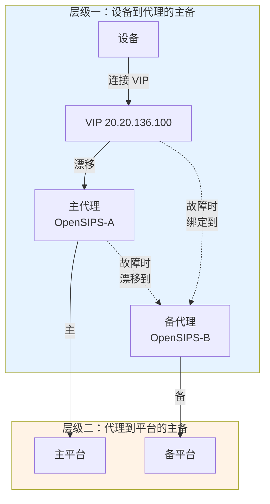
```mermaid
flowchart TD
    subgraph L1["层级一：设备到代理的主备"]
        D["设备"]
        VIP["VIP 20.20.136.100"]
        PA["主代理<br/>OpenSIPS-A"]
        PB["备代理<br/>OpenSIPS-B"]

        D -->|"连接 VIP"| VIP
        VIP -->|"漂移"| PA
        PA -.->|"故障时<br/>漂移到"| PB
        VIP -.->|"故障时<br/>绑定到"| PB
    end

    subgraph L2["层级二：代理到平台的主备"]
        PA -->|"主"| PP["主平台"]
        PB -->|"备"| PB2["备平台"]
    end

    style L1 fill:#E6F3FF
    style L2 fill:#FFF3E6
```

| 层级 | 切换方式 | 实现原理 |
|------|----------|----------|
| **设备→代理** | VIP + Keepalived | 设备连接 VIP，主代理故障时 VIP 自动漂移（约 3 秒） |
| **代理→平台** | Dispatcher 模块 | `ds_select_dst` 按 priority 选择，故障自动切换 |

### 9.2 两级主备架构总结

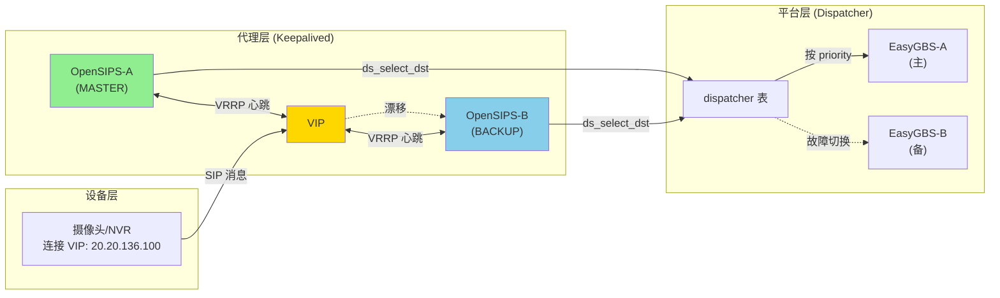
```mermaid
flowchart LR
    subgraph Device["设备层"]
        DEV["摄像头/NVR<br/>连接 VIP: 20.20.136.100"]
    end

    subgraph HA["代理层 (Keepalived)"]
        VIP["VIP"]
        MA["OpenSIPS-A<br/>(MASTER)"]
        MB["OpenSIPS-B<br/>(BACKUP)"]
        MA <-->|"VRRP 心跳"| VIP
        MB <-->|"VRRP 心跳"| VIP
        VIP -.->|"漂移"| MB
    end

    subgraph Platform["平台层 (Dispatcher)"]
        DIS["dispatcher 表"]
        PP["EasyGBS-A<br/>(主)"]
        PB["EasyGBS-B<br/>(备)"]
        DIS -->|"按 priority"| PP
        DIS -.->|"故障切换"| PB
    end

    DEV -->|"SIP 消息"| VIP
    MA -->|"ds_select_dst"| DIS
    MB -->|"ds_select_dst"| DIS

    style VIP fill:#FFD700
    style MA fill:#90EE90
    style MB fill:#87CEEB
```

### 9.3 核心优势

1. **设备零配置**: 设备只需配置一个 VIP 地址，无需配置多个服务器
2. **透明切换**: VIP 漂移对设备透明，设备无感知
3. **数据库独立**: 两台 OpenSIPS 各自维护 SQLite，无数据同步开销
4. **代理到平台解耦**: Dispatcher 实现代理与平台的主备切换
5. **子通道自动管理**: Catalog 解析实现子通道自动注册
6. **架构清晰**: 两级主备切换职责分明，易于维护和排障
